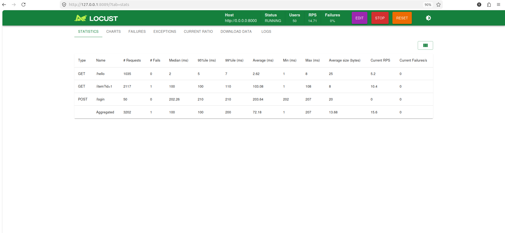
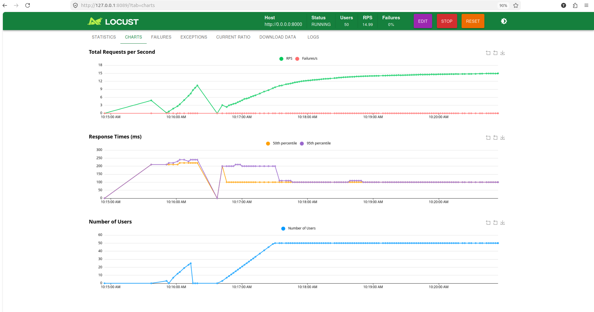

# API Load Testing

A simple FastAPI application with Locust-based load testing.

## Project Structure

- `main.py` — FastAPI app with three endpoints
- `locust.py` — Locust load test scenarios

## Endpoints

| Method | Path       | Description              |
|--------|------------|--------------------------|
| GET    | `/hello`   | Returns a greeting       |
| GET    | `/item`    | Simulates DB lookup      |
| POST   | `/login`   | Simulates authentication |

## Quick Start

```bash
# Install dependencies
pip install -r requirements.txt

# Run the API server
uvicorn main:app

# Run load tests (in another terminal)
locust -f locust.py
```

## Locust Tasks

- **Tag `tag1`** — `get_item` (weight 2): Hits `/item?id=1`
- **Tag `tag2`** — `hello` (weight 1): Hits `/hello`
- **Setup** — Each simulated user logs in via `POST /login` on start

## Results

### Statistics



### Charts


